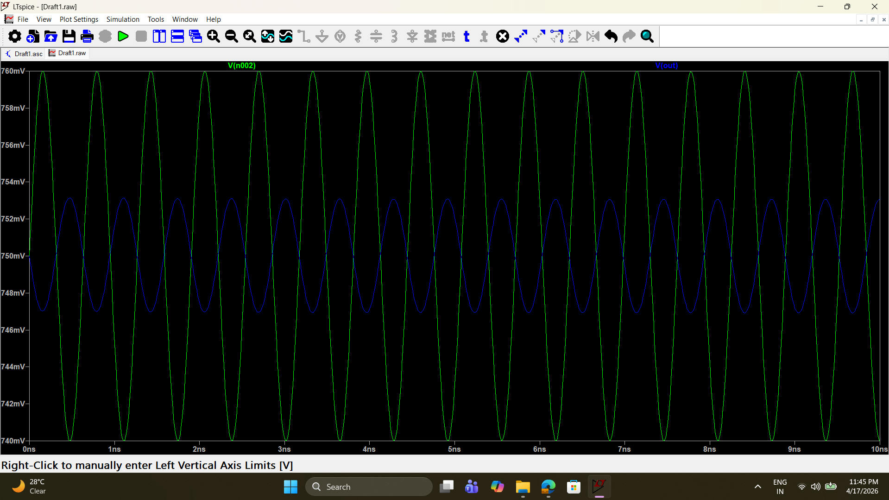
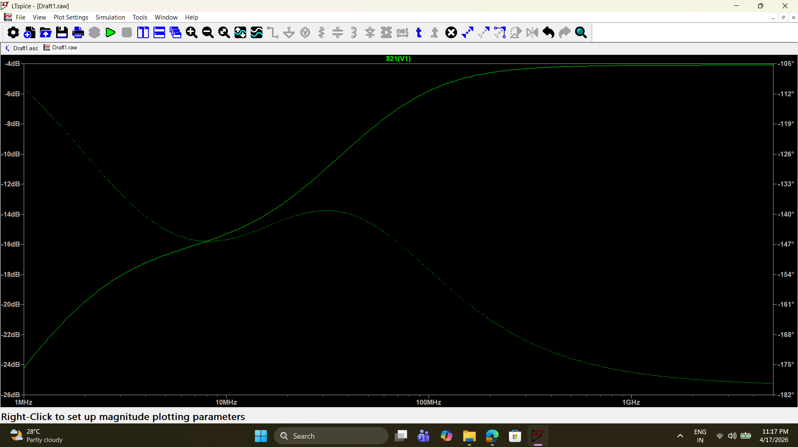

# Design and Analysis of a 1.575 GHz CMOS Low Noise Amplifier (LNA)

This repository contains the schematic design, simulation, and physical analysis of two Low Noise Amplifier (LNA) topologies targeting the GPS L1 band (1.575 GHz). The circuits were simulated using 100nm CMOS technology models in LTspice. 

This project explores the fundamental trade-offs between ultra-low power consumption and optimal RF performance (Noise Figure, Impedance Matching, and Reverse Isolation) by comparing a restricted complementary inverter against a standard Cascode topology with LC tuning.

📄 **[Read the full IEEE-format Technical Report here](Documents/LNA_IEEE_Report.docx)**

---

## 🛠️ Tools & Technologies Used
* **Simulation Environment:** LTspice XVII
* **Technology Node:** 100nm CMOS (Level 3 Models)
* **Analyses Performed:** S-parameters (AC Sweep), Noise Figure Extraction, Time-Domain Transient Analysis, DC Operating Point Stabilization.

---

## Architecture 1: Constrained Complementary Inverter LNA
The first phase of the project serves as a pedagogical baseline. The design is restricted to a bare complementary inverter (NMOS + PMOS) driving a 50Ω load directly. **No LC impedance matching networks** (such as source-degeneration or gate inductors) were permitted.

### Key Features:
* **Active Feedback Biasing:** An ideal operational amplifier feedback loop dynamically regulates the tail NMOS to perfectly center the output DC operating point at $V_{DD}/2$ (0.75V).
* **Ultra-Low Power:** Draws only 0.617 mA, resulting in **0.925 mW** total power dissipation.

### Simulation Results:
Because this topology lacks reactive matching networks, it is physically impossible to synthesize a real 50Ω input resistance. Therefore, the results reflect the intrinsic behavior of raw, unmatched silicon:
* **Gain ($S_{21}$):** -3.8 dB (Attenuation mathematically expected due to high-impedance output driving a 50Ω load).
* **Input Reflection ($S_{11}$):** ~0 dB (Total reflection).
* **Noise Figure (NF):** 11.5 dB (Unmatched optimum noise impedance).

*Fig 1: Transient analysis confirming 180° phase inversion, strict 750mV DC centering, and expected amplitude attenuation.*

---

## Architecture 2: Cascode LNA with LC Tuning
The second phase upgrades the baseline by implementing a Cascode topology (common-source amplifier stacked with a common-gate shield) and an output LC resonant tank tuned specifically to 1.575 GHz.

### Key Features:
* **Cascode Shielding:** The upper NMOS is biased to a pure DC source (AC Ground), creating a physical barrier that prevents output voltage swings from leaking backward.
* **LC Resonance:** An output tank ($L=5\text{nH}, C=2\text{pF}$) acts as a frequency-selective impedance multiplier.

### Simulation Results:
* **Gain ($S_{21}$):** Peaks at **+2 dB** exactly at 1.575 GHz due to LC resonance.
* **Reverse Isolation ($S_{12}$):** $-\infty$ dB (The Cascode architecture provides near-perfect shielding, dropping isolation below the simulator's numerical floor).
* **Noise Figure (NF):** **6.5 dB** (A massive 5 dB improvement over the unmatched inverter).
* **Input Reflection ($S_{11}$):** ~0 dB (Remains fully reflective as the schematic still deliberately omits inductive source degeneration).

*Fig 2: S21 (Gain) and Noise Figure showing the resonant "mountain" and "bucket" profiles tuned perfectly to the GPS L1 band.*

---
*Designed by Prakhar Singh — Manipal Institute of Technology (MIT)*
